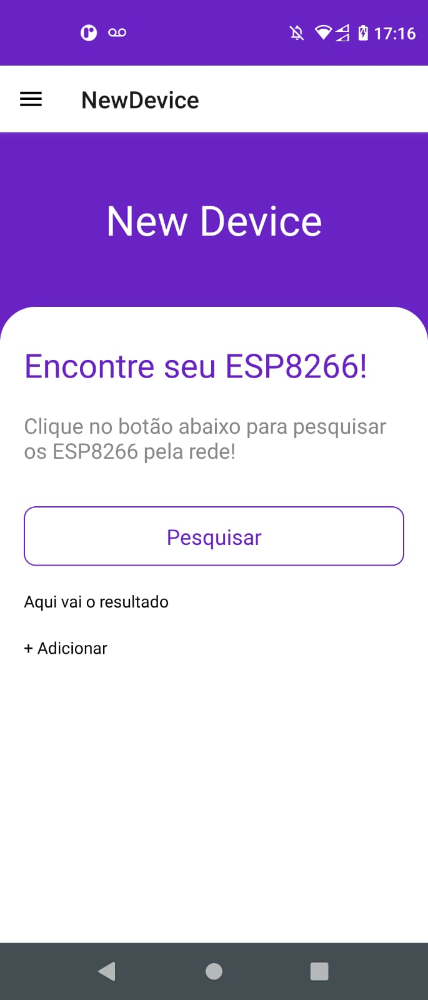

# :desktop_computer: ESP8266 Application

## :briefcase: Stacks

✅ JavaScript
✅ React Native

## :hammer: Tools

- Git (`git -v`)
- NodeJs (`node --version`/`npm --version`)
- VS Code
- JDK
- Chocolatey: `choco install -y nodejs-lts microsoft-openjdk11`
- Android Studio

## :fire: Run

- Dev (Android): `npx react-native run-android`
- Devices: `adb devices`
- Clear: `npx react-native start --reset-cache`

## :baby: Created

- React Native: `npx react-native@latest init esponoff`

## :ok_man: Dependencies

- Drawer Dependencies: `npm install @react-navigation/drawer @react-navigation/native @react-navigation/stack react-native-gesture-handler react-native-reanimated react-native-safe-area-context react-native-screens`
- Bottom Dependencies: `npm install @react-navigation/bottom-tabs`
- Dependencies: `npm install react-native-animatable react-native-linear-gradient react-native-vector-icons styled-components react-native-udp @react-native-async-storage/async-storage`
